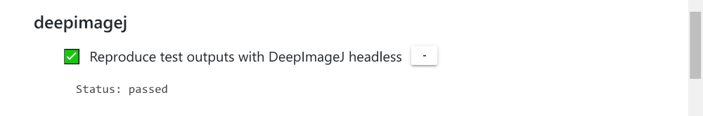
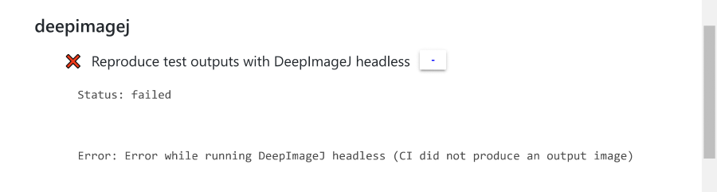
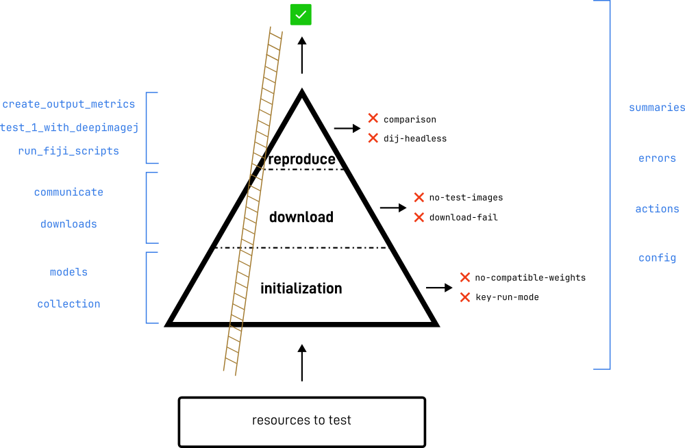

# CI-deepimagej-bioimage-io
System for the automatic testing of models from the Biomage Model Zoo in DeepImageJ.

- The **input** of the system is the specification of the models to test (in json format)
- The **output** is a test summary for each of the input models (in yaml files).
  - The test summary "pass" if the model was able to run on DeepImageJ headless mode (and produce the correct output).
  - Otherwise, the test summary "failed" and contains information of the error encountered.

The test summaries are saved in the `gh-pages` branch of this repository.
Additional information is also saved in that branch, e.g:
- `report.json`: a detailed report with the results for every model.
- `Readme.md`: a summary of the results.

## Why?
The content of the test summaries is rendered in each of the model cards of [bioimage.io](https://bioimage.io/).
This will give information to users on whether each of the models will work on DeepImageJ. In this way, the user can 
choose only the models that we know to be working properly, and avoid surprises when downloading a model that will not work.

Models that pass the CI will display on the webpage similarly to the figure below. In the `Test Summary` section of the model card,
clicking in `[more details]`.

On the other hand, models that fail will display the image below on its model card.

The error information can also help in addressing it, as it specifies the point where the testing process failed.

## How?
The main idea consist on a progressive filtering of all the input models during the different stages of testing.
The models that go through all process are the ones which pass. For the rest, the corresponding error is detected.

The CI is divided in 3 stages:
1. **init**: Parses the input and prepares the models to be tested.
2. **download**: Download of the models from [bioimage.io](https://bioimage.io/).
3. **reproduce**: Run the models inside Fiji, with DeepImageJ headless mode. Compare with the expected output images.

Each stage has different kind of errors that can happen. These are detected and reported in the corresponding test summary.

The words in blue represent code name-spaces that implement the functionality. 
Some of the code focuses only on the requirements for 1 of the stages, whereas other code is needed all through the CI.

# Local testing of models from the zoo
- Change directory to `python_CI_scripts/` or to `java_CI_scripts/`.
- Follow the instructions from the `Readme.md` there.

# Resources:
- [Bioimageio Wiki](https://github.com/bioimage-io/bioimage.io/wiki/Contribute-community-partner-specific-test-summaries)
- [Issue](https://github.com/bioimage-io/collection-bioimage-io/issues/515)

