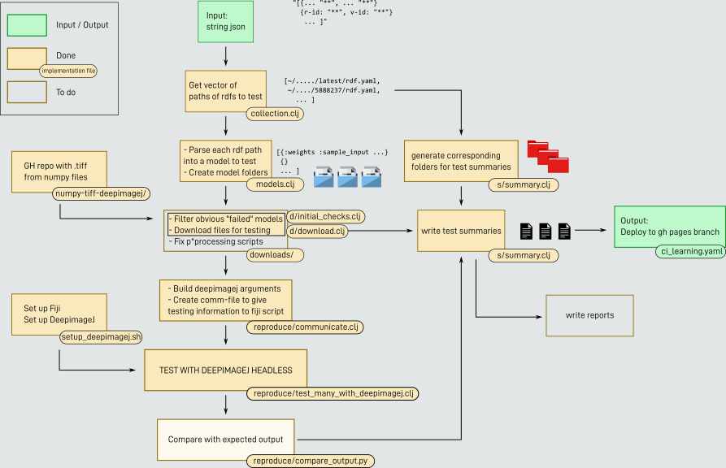

# CI-deepimagej-bioimage-io
Scripts and gh workflows for testing the models of the bioimage model zoo in DeepImageJ

# Local Setup
- change directory to `bash_scripts`
- run `local_setup.sh`
- this will clone
  - the bioimage.io collection repository
  - the numpy-tiffs repository

# Local testing
- change directory to `java_CI_scripts`
- follow the instructions from the Readme there

# CI Plan Diagram

